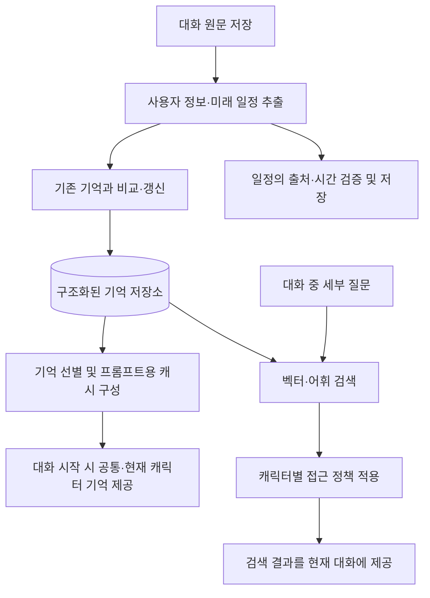

# LLM Memory System

LLM API 기반 대화에서 사용자 정보를 추출·저장하고, 대화 맥락에 필요한 기억을 선택적으로 제공하는 외부 기억 시스템.

로봇 비서·친구 프로젝트인 MindMate를 개발하면서, 세션이 바뀌어도 사용자의 선호와 이전 대화 맥락을 활용할 수 있도록 기억 시스템을 설계·구현했다. MindMate 팀 프로젝트에서 기억 시스템의 설계와 구현을 단독으로 담당했으며, 이 저장소는 해당 모듈을 중심으로 구성했다.

현재 기본적인 기억 추출·갱신·선별·검색 기능을 구현했으며, 보관된 기억의 재활성화와 정보의 유효성 관리를 연구하고 있다.

## 프로젝트 목적

전체 대화 이력을 매번 모델에 전달하면 대화가 누적될수록 입력 문맥과 처리 비용이 증가한다. 반면 짧은 요약만 유지하면 이후 질문에 필요한 이름, 수치, 세부 조건 등이 빠질 수 있다.

이 프로젝트는 대화에서 추출한 정보를 구조화해 저장하고, 선별된 기억을 시작 프롬프트에 제공한다. 기본 프롬프트에 포함되지 않은 세부 정보는 질문에 따라 추가로 검색한다. 제한된 입력 문맥 안에서 대화의 연속성과 필요한 정보의 회상을 함께 확보하는 것이 목표다.

## 현재 구현 구조



| 기능 | 현재 구현 |
| --- | --- |
| 기억 추출 | 대화에서 사용자 관련 사실과 미래 일정을 추출 |
| 기억 갱신 | 기존 기억과 비교해 `ADD`·`UPDATE`·`NOOP`·`CONFLICT` 처리 |
| 기억 선별 | 중요도·신뢰도·최근성·유효기간 등을 고려해 프롬프트에 포함할 기억 선택 |
| 기억 보관 | 기본 프롬프트에서 제외한 기억을 `parked`·`archived` 등의 상태로 관리 |
| 상세 회상 | 벡터 유사도와 어휘 검색 후보를 결합하고 관련성·최근성·중요도 등을 반영해 정렬 |
| 캐릭터별 기억 범위 | 공통 기억과 캐릭터 전용 기억을 구분하고 접근 정책 적용 |
| 미래 일정 | 일정의 출처 발화와 시간 정보를 검증하고 저장·조회 |
| Reflection | 여러 사실을 종합한 상위 통찰을 별도 요청으로 생성·저장 |

`UPDATE`와 `CONFLICT`는 이전 기억을 만료·보관 처리하고 새 기억을 추가한다. `CONFLICT`는 충돌을 별도로 심사해 진위를 확정하는 기능까지 의미하지 않는다. 미래 일정은 저장·조회 단계이며 알람 실행기는 포함하지 않는다.

### 기억 저장과 프롬프트 선별의 분리

| 저장 대상 | 역할 |
| --- | --- |
| `raw_sessions` | 대화 원문 보관 |
| `memory_facts` | 추출된 사실, 임베딩, 중요도, 시간, 접근 범위와 상태 저장 |
| `user_memory_sections` | 공통·캐릭터별로 선별한 프롬프트용 기억 캐시 |
| `future_tasks` | 미래 일정과 시간 정보, 확인 필요 여부, 출처 저장 |
| `reflections` | 여러 사실에서 도출한 통찰과 근거 기억 ID 저장 |

이들은 PostgreSQL 안의 서로 다른 테이블로 관리한다. 현재 대화에서 우선순위가 낮아진 기억은 기본 프롬프트에서 제외하되, 기억 저장소에 보관해 필요할 때 검색할 수 있도록 구성했다.

현재 상세 회상은 `memory_facts`를 대상으로 한다. 대화 원문까지 자동으로 재검색하는 구조는 아니며, 추출 단계에서 누락된 정보는 일반적인 기억 검색만으로 복구할 수 없다.

### 보관된 기억의 검색과 재활성화

보관된 기억을 검색해 **현재 답변에 제공하는 기능**은 구현되어 있다. 검색된 기억을 이후 대화의 기본 프롬프트에 다시 포함하도록 **자동 재활성화하는 정책**은 연구 중이다.

또한 프롬프트에서의 우선순위와 사실의 유효성은 별도로 다룬다. 오래되어 자주 사용하지 않는 정보와, 정정되어 더 이상 현재 사실로 사용할 수 없는 정보는 다른 상태다. 현재 상세 검색 경로의 만료 처리와 프롬프트 캐시 갱신에는 일관성 보완이 필요하다.

## 진행 중인 연구

> 제한된 입력 문맥 안에서 필요한 기억을 선별하면서, 보관된 과거 기억을 언제 다시 활용하고 어떤 조건에서 재활성화해야 하는가?

다음 항목은 현재 검토 중인 개선 방향이며, 개선 구현과 비교 평가는 아직 완료하지 않았다.

| 연구 주제 | 검토 내용 |
| --- | --- |
| 기억 재활성화 | 검색한 기억을 현재 답변에만 사용할지, 이후 대화에서도 활용하도록 다시 선별할지 판단하는 기준 |
| 유용성 기반 선별 | 단순한 선택·검색 횟수와 실제 답변 기여도를 구분하고 관련성·반복적인 필요성을 함께 반영하는 방법 |
| 현재 사실과 과거 이력 | 정정·만료된 정보를 현재 사실로 재사용하지 않으면서 과거에 관한 질문에는 시점을 구분해 제공하는 방법 |
| 세부 정보와 근거 보존 | 요약에서 손실될 수 있는 이름·수치·조건을 보존하고 추출된 사실을 원문 발화와 연결하는 방법 |
| 정책과 캐시의 일관성 | 기억 변경이 프롬프트 캐시·검색·Reflection·도구 응답에 일관되게 반영되도록 하는 방법 |

재활성화 기준은 동일한 모델과 입력 예산에서 비교할 계획이다. 필요한 근거를 찾는 비율, 최종 답변의 정확성, 오래된 사실의 잘못된 재사용 여부를 함께 측정하고, 기억의 추출·갱신·검색·생성을 포함한 전체 비용과 지연을 평가한다.

## 예비 실험과 평가 범위

2026년 6월 9일, LongMemEval-S의 한 대화 항목을 바탕으로 구성한 자체 질문 10개를 사용해 기억 제공 방식에 따른 답변을 비교했다.

| 조건 | 기억 제공 방식 | 완전 정답 | 첫 입력 토큰 |
| --- | --- | ---: | ---: |
| T1 | 기억 없음 | 2/10 | 103 |
| T2 | 대화 원문 전체 | 10/10 | 102,899 |
| T3 | 선별·축약된 기억만 제공 | 4/10 | 991 |
| T3R | 선별·축약된 기억과 추가 검색 | 8/10 | 1,180 |

T3R은 T1·T2·T3와 별도 실행에서 얻은 결과다. 이 사례에서는 축약된 기억만 제공한 조건보다 추가 검색을 사용한 조건에서 완전 정답이 많았지만, 일부 수치 정보에는 여전히 정확히 답하지 못했다.

이 결과는 LongMemEval 전체의 공식 벤치마크 점수가 아니다. 질문을 연속으로 제시해 앞선 문항의 정보가 이후 답변에 영향을 줄 수 있었고, 사용한 기억 범위도 현재 활성 캐릭터 중심의 서비스 경로와 차이가 있다. 첫 입력 토큰은 이후 검색과 대화, 기억 생성·갱신에 드는 전체 비용을 나타내지 않는다.

후속 평가는 실제 API와 도구 응답 경로를 사용하고, 독립 질문 평가와 연속 대화 평가를 분리하는 방향으로 설계하고 있다.

## 기술 구성과 코드

Python 3.12.10, FastAPI, PostgreSQL 16, pgvector, OpenAI API를 사용한다.

| 경로 | 역할 |
| --- | --- |
| [server/main.py](server/main.py) | 기억 서비스 API |
| [server/memory.py](server/memory.py) | 기억 추출·갱신·임베딩·검색·Reflection |
| [server/character_memory.py](server/character_memory.py) | 캐릭터별 기억 선별과 프롬프트용 캐시 |
| [server/memory_policy.py](server/memory_policy.py) | 기억 접근 정책 |
| [server/memory_lifecycle.py](server/memory_lifecycle.py) | 시간 기준과 기억 수명 관련 규칙 |
| [server/future_tasks.py](server/future_tasks.py) | 미래 일정 검증·저장·조회 |
| [src/](src/) | 기억 서버 클라이언트와 대화 모델용 도구 |
| [eval/](eval/) | 기억 제공 방식·검색·캐릭터 정책 평가 도구 |
| [tests/](tests/) | 미래 일정 관련 단위·DB 테스트 |

## 로컬 실행

Python 3.12.10과 Docker Compose가 설치된 환경을 기준으로 한다. 다음 명령은 저장소 루트에서 PowerShell로 실행한다.

### 1. Python 환경 구성

```powershell
py -3.12 -m venv .venv
.\.venv\Scripts\python.exe -m pip install -r requirements.txt
Copy-Item .env.example .env
```

`.env`의 `OPENAI_API_KEY`를 설정한다. 기억 추출·임베딩·갱신 판단·Reflection에는 API 호출이 발생한다. 모델 설정은 `.env.example`에 정의되어 있다.

### 2. 전용 데이터베이스와 예제 프로필 준비

```powershell
docker compose -f docker-compose.postgres.yml up -d --wait
.\.venv\Scripts\python.exe tools/seed_character_memory.py --fixture server/fixtures/character_memory_seed.example.json
```

기본 DB 주소는 `localhost:5433/llm_memory`다. 예제 파일에는 데모 사용자와 `study`·`cooking` 캐릭터가 들어 있으며 기억 항목은 비어 있다. 명령 출력의 사용자 ID와 데모 API 키를 로컬 API 확인에 사용한다.

서버 시작과 초기 데이터 등록 시 스키마를 적용하므로 이 저장소의 전용 개발 DB를 사용한다. 기본 DB 계정과 예제 API 키는 로컬 데모용이다.

### 3. API 서버 실행

```powershell
.\.venv\Scripts\python.exe -m uvicorn server.main:app --host 127.0.0.1 --port 8000
```

[API 문서](http://127.0.0.1:8000/docs)에서 `Authorize`에 예제 API 키를 입력한 뒤 다음 순서로 확인한다.

| 순서 | API | 용도 |
| --- | --- | --- |
| 1 | `POST /users/{user_id}/sessions` | 대화 원문 등록 |
| 2 | `POST /users/{user_id}/sessions/{session_id}/extract` | 해당 세션의 기억과 미래 일정 추출 |
| 3 | `GET /users/{user_id}/characters/{character_id}/memory-pack` | 공통·현재 캐릭터의 기억 묶음 조회 |
| 4 | `POST /users/{user_id}/recall-detail` | 질문에 따른 상세 기억 검색 |

`GET /health/db`로 DB 연결을 확인할 수 있다. 일괄 재추출 API인 `extract-all`은 기본값 `reset=true`에서 기존 facts와 reflections를 삭제한 뒤 재생성하므로 위 세션별 확인 흐름과 구분한다.

### 테스트와 평가 의존성

```powershell
.\.venv\Scripts\python.exe -m pip install -r requirements-dev.txt
.\.venv\Scripts\python.exe -m unittest discover -s tests -v
```

DB 통합 테스트는 별도의 테스트 DB 주소를 `FUTURE_TASK_TEST_DATABASE_URL`로 지정했을 때 실행된다. 일반 평가 도구의 추가 의존성은 `requirements-eval.txt`, Mem0 비교 도구의 추가 의존성은 `requirements-mem0.txt`에 있다. Mem0 패키지는 기본 기억 서버의 필수 의존성이 아니다.

## 참고 연구와 적용 범위

기존 연구에서 필요한 개념을 참고해 기억 추출·갱신·검색과 캐릭터별 정책을 구성했다. 각 논문의 전체 시스템이나 보고된 성능을 재현한 것은 아니다.

| 연구 | 설계에 참고한 부분 |
| --- | --- |
| [Mem0: Building Production-Ready AI Agents with Scalable Long-Term Memory](https://arxiv.org/abs/2504.19413) | 대화에서 기억을 추출하고 기존 기억과 비교해 갱신하는 흐름 |
| [Generative Agents: Interactive Simulacra of Human Behavior](https://arxiv.org/abs/2304.03442) | 관련성·최근성·중요도를 고려한 회상과 Reflection |
| [A-MEM: Agentic Memory for LLM Agents](https://arxiv.org/abs/2502.12110) | 사실 단위 기억과 메타데이터를 이용하는 구조화 방향 |

A-MEM의 동적 링크와 기억 진화 구조 전체는 현재 구현 범위에 포함되지 않는다. 예비 실험은 LongMemEval의 장기 대화 회상 평가 관점을 참고해 별도로 구성했다.
